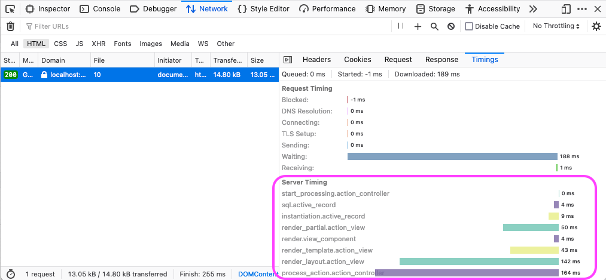

# Instrumentation

Since 2.34.0
{: .label }

To enable ActiveSupport notifications, use the `instrumentation_enabled` option:

```ruby
# config/application.rb
# Enable ActiveSupport notifications for all ViewComponents
config.view_component.instrumentation_enabled = true
config.view_component.use_deprecated_instrumentation_name = false
```

Setting `use_deprecated_instrumentation_name` configures the event name. If `false` the name is `"render.view_component"`. If `true` (default) the deprecated `"!render.view_component"` will be used.

Subscribe to the event:

```ruby
ActiveSupport::Notifications.subscribe("render.view_component") do |event| # or !render.view_component
  event.name    # => "render.view_component"
  event.payload # => { name: "MyComponent", identifier: "/Users/mona/project/app/components/my_component.rb" }
end
```

## Viewing instrumentation sums in the browser developer tools

When using `render.view_component` with `config.server_timing = true` (default in development) in Rails 7, the browser developer tools display the sum total timing information in Network > Timing under the key `render.view_component`.



## Viewing instrumentation breakdowns in rack-mini-profiler

The [rack-mini-profiler gem](https://rubygems.org/gems/rack-mini-profiler) is a popular tool for profiling rack-based Ruby applications.

To profile ViewComponent rendering alongside views and partials:

```ruby
# config/environments/development.rb
# Profile rendering of ViewComponents
Rack::MiniProfilerRails.subscribe("render.view_component") do |_name, start, finish, _id, payload|
  Rack::MiniProfilerRails.render_notification_handler(
    Rack::MiniProfilerRails.shorten_identifier(payload[:identifier]),
    finish,
    start
  )
end
```
